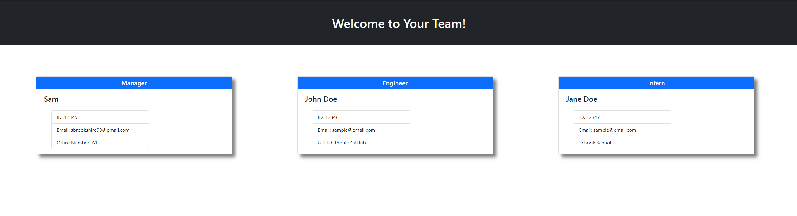

# Team Profile Generator

Need a quick way to put together your work teams? This command line program will take the important organizational data for the different members of your team and return a custom, dynamically generated website with styling to easily showcase the data.

## Future Features and Known Issues

- Can only create one team at a time
- Just plain HTML and CSS, could start a web server with the information
- Generate more than one page at a time

## Tutorial

Linked is a Google Drive video on using this application:

```
As a note for grading, all of my classes are stored in one file, so the test is only one file but it tests all 4 classes at once.
```

[Google Drive Video](https://drive.google.com/file/d/14q8MMlGqw1ED2knUyFXfBSEWqXzCbNxS/view)

## Sample Website



### Credits and Contributions

- Website built using Bootstrap.
- Application built with Node.JS
